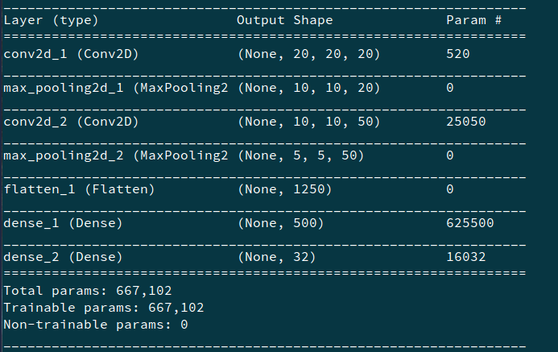
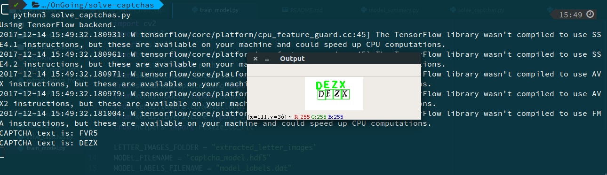
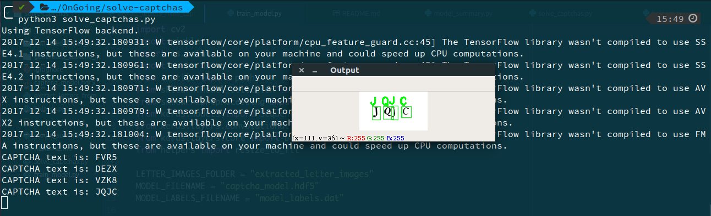

# CAPTCHA Solver (Wordpress CAPTCH Plug-In)

## Dependencies

1. Python 3
2. OpenCV 3 w/ Python extensions
3. numpy
4. sklearn
5. tensorflow
6. keras
7. imutils

## To run

1. python3 extract_letters_from_captcha.py
2. python3 train_model.py
3. python3 solve_captchas.py

## Model Summary

  

## Results

  

  

